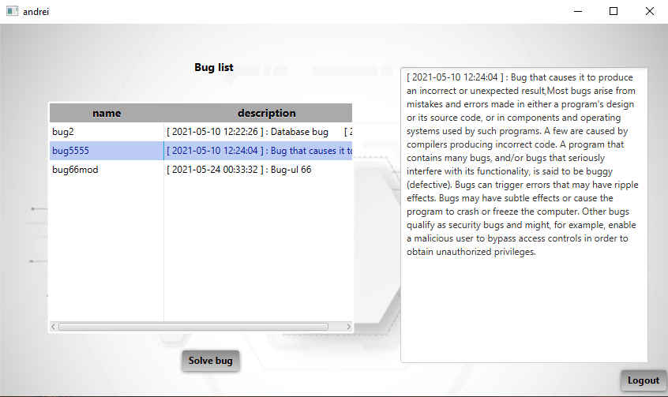
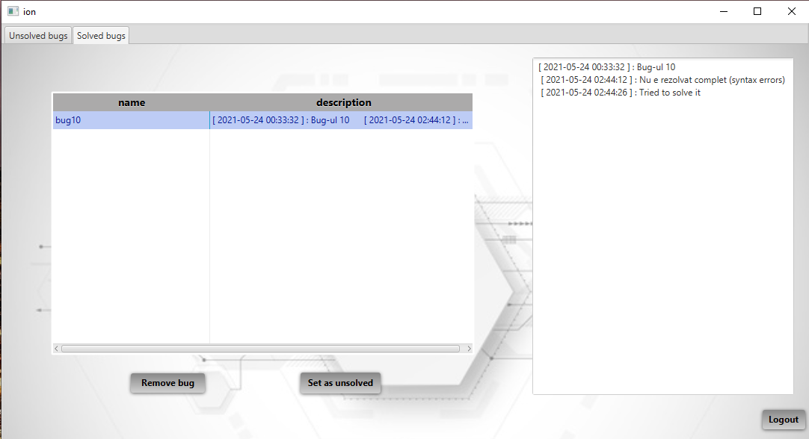

# Bug-Solving

Client-server app used for communication between programmers and testers working in a company with functionalities such as login, logout, adding bug, solving bug, checking a bug’s status

